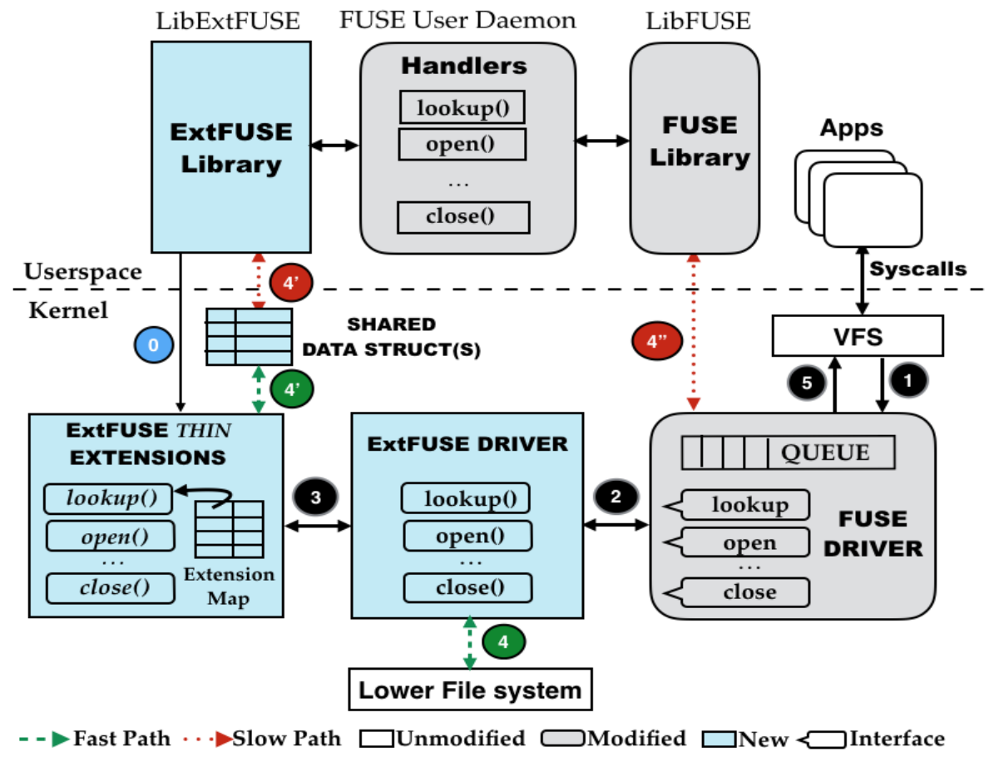

## ExtFUSE：利用eBPF优化FUSE的用户扩展框架

ExtFUSE框架详情见：https://github.com/13186379707/boke/tree/main/ExtFUSE_document

​		用户空间扩展文件系统(Extended Filesystem in Userspace，简称ExtFUSE)是一个开源的文件系统框架，允许开发者编写自定义的文件系统驱动程序。它基于FUSE（Filesystem in Userspace）技术，并且允许用户空间的程序创建和操作文件系统，而不需要特权访问。通过使用ExtFUSE，开发人员可以在用户空间实现自己的文件系统，而无需修改内核代码。这使得创建独特的文件系统变得更加灵活和简单，从而满足各种应用程序的需求。无论您是想创建一个虚拟文件系统、加密文件系统还是实现其他自定义文件系统功能，ExtFUSE都可以为您提供一个可靠的框架。

​		ExtFUSE不仅拥有FUSE的各项基本功能，而且在此基础上增加了高度可扩展和快速开发等功能。ExtFUSE 提供了丰富的 API和抽象，使开发人员可以在内核中实现对文件操作的各个方法进行快速开发，形成扩展结构，减少该方法运行时的性能开销，从而达到优化文件系统性能的目的。

​		ExtFUSE的总体架构图如下图所示，它由三个核心组件启用，即内核文件系统(驱动程序)、用户库(libExtFUSE)和内核内eBPF虚拟机运行时(VM)。

- **ExtFUSE驱动程序(ExtFUSE driver)**使用插入技术在低级文件系统操作中与FUSE兼容。然而，与FUSE驱动程序只是将文件系统请求打包转发到用户空间不同，ExtFUSE驱动程序能够直接将请求传递到内核处理程序(扩展)。它还可以将一些受限的请求集(例如，读、写)转发到主机(下)文件系统(如果存在的话)。后者对于在主机文件系统之上添加精简功能的可堆叠用户文件系统是必需的。libExtFUSE导出一组api和抽象，用于在内核中服务请求，隐藏底层实现细节。

- **libExtFUSE的使用是可选的，独立于lifuse。**向libfuse注册的现有文件系统处理程序继续驻留在用户空间中。因此，它们的调用会引起上下文切换，因此，我们将它们的执行称为慢路径。使用ExtFUSE，用户空间还可以注册内核扩展，当从VFS接收到文件系统请求时立即调用这些扩展，以便允许在内核中提供这些扩展。我们将内核内执行称为快速路径。根据快速路径的返回值，可以将请求标记为已服务，或者通过慢路径将请求发送到用户空间守护进程，以便根据需要进行复杂的处理。快速路径还可以返回一个特殊值，指示ExtFUSE驱动程序插入并将请求转发到下层文件系统。但是，此特性仅适用于可堆叠的用户文件系统，并且在内核中加载扩展时进行验证。

ExtFUSE框架的复现过程详情见：https://github.com/13186379707/boke/blob/main/ExtFUSE_document/framework_reproduction/extfuse_framework.pdf 文件

## 项目eBPF_FUSE_read：使用eBPF优化FUSE中的read方法性能

详情见：https://github.com/13186379707/eunomia-bpf/tree/develop/eBPF_Supermarket/eBPF_FUSE/eBPF_FUSE_read

## 项目os_fuse：使用 eBPF 进行 serverless 场景下或 FUSE 文件系统的增强和性能优化
### （已有课题，是否可以更新一下去年的课题？）

原本的赛题：https://github.com/oscomp/proj147-eBPF-FUSE

### 项目名称

使用 eBPF 进行 serverless 或 FUSE 文件系统的增强和性能优化

### 项目描述

随着云计算和容器化技术的不断发展，serverless 和 FaaS (Function as a Service) 的概念越来越受到关注。它们提供了一种全新的开发方式，使得开发者可以不用考虑服务器资源的管理和调度，专注于应用程序的逻辑实现。

在 serverless 和 FaaS 模型下，函数运行环境是动态创建和销毁的，因此安全问题尤为重要。本项目旨在利用 eBPF 技术，提供一种轻量级的文件系统沙盒框架，使得开发者能够安全地在 serverless 和 FaaS 环境中运行非受信第三方代码。

Filesystem in User-SpacE(FUSE)是Linux内核的用户态文件系统接口，方便用户实现用户态文件系统并与Linux内核对接。FUSE接口目前有很大的性能瓶颈，由于FUSE在用户态和内核态之间的数据传输要做内存拷贝；之前有一些使用 eBPF 优化 FUSE 性能的实践，但只对元数据访问进行了优化，并没有涉及内存拷贝的部分。

参赛团队可以选择将 eBPF 与 FUSE 或 WrapFS 相结合，或者将 eBPF 结合其他类似的技术，实现文件系统沙盒的增强和性能优化；或者基于 eBPF 实现高性能的用户态文件系统功能，同时要求保证高性能，即在用户态和内核态之间传输数据时避免内存拷贝。

参考资料：

- https://sandfs.github.io
- “A Lightweight and Fine-grained File System Sandboxing ” Paper
- “when eBPF meets FUSE” in OSS NA’18, LPC’18

### 所属赛道

2023全国大学生操作系统比赛的“OS功能设计”赛道

### 难度

- 基础特性的难度：中等
- 高级特性的难度：较高

### 基本要求

- 使用 eBPF 技术实现 serverless 或 FUSE 文件系统沙盒
- 提供 fine-grained 的访问控制
- 允许动态 (programmatic) 的自定义安全检查
- 具备低性能开销

### 预期目标

- **提供安全的 serverless 和 FaaS 环境。** 本项目旨在利用 eBPF 技术提供一种轻量级的文件系统沙盒框架，使得开发者能够安全地在 serverless 和 FaaS 环境中运行非受信第三方代码。为了达到这一目标，本项目需要提供 fine-grained 的访问控制和动态 (programmatic) 的自定义安全检查。
- **优化 serverless 和 FaaS 环境的性能。** 由于 serverless 和 FaaS 环境下函数运行环境是动态创建和销毁的，因此文件系统沙盒的性能对于整个应用程序的性能影响非常大。参赛团队可以尝试使用 eBPF 技术对 serverless 和 FaaS 环境的文件系统进行优化，以提高应用程序的性能。
