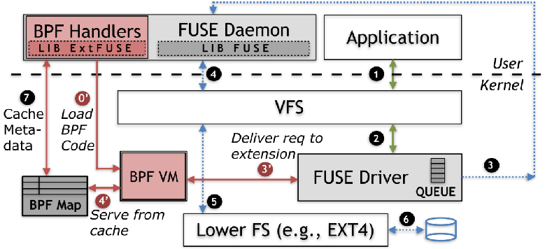

## 项目1、eBPF_FUSE_read：使用eBPF优化FUSE read方法性能

### 项目描述：

​		FUSE（Filesystem in Userspace）是一个常用的用户空间文件系统框架，它允许用户空间程序实现自己的文件系统，并且可以通过内核的VFS（Virtual File System）接口进行挂载和管理。但是，FUSE存在性能瓶颈，其中之一就是在文件读取时存在内存拷贝，特别是在大量的小文件读取场景。

​		eBPF（Extended Berkeley Packet Filter）是Linux内核提供的一种强大的动态追踪和过滤技术，它可以使用户空间程序在不修改内核代码的情况下，对内核执行的系统调用、网络数据包等进行监控和处理。近年来，eBPF已经成为了Linux系统中优化性能和安全的重要工具之一。

​		本题目旨在探索使用eBPF技术优化FUSE文件系统的read性能，并在某一个场景下验证，例如大量小文件拷贝场景等，可与社区导师商榷后确定。

### 项目策略框架：

**框架实现过程描述：**

(1)当用户空间应用程序发出lookup命令后，经过系统调用传递至VFS层；

(2)VFS层将请求识别并下发至FUSE驱动层；

(3’)FUSE驱动会首先前往BPF VM空间中进行查询；

(4’)在BPF VM空间中有真正存储元数据的BPF Map结构，内核会对该结构中的元数据进行查询。如果查询到目标元数据，则进入(7)，否则，返回(3’)；

(3)如果在BPF Map中查询失败后，将经过(3’)返回到FUSE驱动层，接下来FUSE驱动会将请求通过内核—用户之间的通信通道传递给FUSE Daemon；

(4)经过FUSE Daemon一般用户请求处理并筛选出其中的I/O请求之后，通过系统调用将其传递给VFS层；

(5)接下来，VFS层将I/O请求转发至下层的文件系统；

(6)最后，右下层的文件系统实现对磁盘数据的真正的I/O操作，并将其返回给用户空间应用程序；

(7)如果在(4’)中查询到了目标元数据，则直接通过BPF映射结构以及相应的BPF Handlers(对BPF Map操作的函数)将其给与FUSE Daemon，FUSE Daemon会将目标元数据返回给用户空间的应用程序。

(0‘)这一步是由于原本在BPF Map中未查询到目标数据，前往磁盘中取得目标数据之后，通过BPF Handlers将目标数据存放至BPF Map结构之中。虽然这一步不属于ExtFUSE框架的工作流程，但这一步为下一次用户空间获取文件数据的优化做出了贡献。

### NOTE：由于目前关于eBPF_FUSE_read项目的进展均是基于ubuntu16.04版本进行的，因此有些涉及到内核代码修改部分的工作无法在lmp仓库中进行展示，因此，如果想要了解关于该项目更详细的内容，请前往该仓库：https://github.com/13186379707/boke/tree/main

## 项目2、proj201-ebpf-optimize：使用 eBPF 进行 serverless 场景下或 FUSE 文件系统的增强和性能优化（2023年）
### （已有课题，是否可以更新一下去年的课题？）

2022年的赛题：https://github.com/oscomp/proj147-eBPF-FUSE

### 项目名称

使用 eBPF 进行 serverless 或 FUSE 文件系统的增强和性能优化

### 项目描述

随着云计算和容器化技术的不断发展，serverless 和 FaaS (Function as a Service) 的概念越来越受到关注。它们提供了一种全新的开发方式，使得开发者可以不用考虑服务器资源的管理和调度，专注于应用程序的逻辑实现。

在 serverless 和 FaaS 模型下，函数运行环境是动态创建和销毁的，因此安全问题尤为重要。本项目旨在利用 eBPF 技术，提供一种轻量级的文件系统沙盒框架，使得开发者能够安全地在 serverless 和 FaaS 环境中运行非受信第三方代码。

Filesystem in User-SpacE(FUSE)是Linux内核的用户态文件系统接口，方便用户实现用户态文件系统并与Linux内核对接。FUSE接口目前有很大的性能瓶颈，由于FUSE在用户态和内核态之间的数据传输要做内存拷贝；之前有一些使用 eBPF 优化 FUSE 性能的实践，但只对元数据访问进行了优化，并没有涉及内存拷贝的部分。

参赛团队可以选择将 eBPF 与 FUSE 或 WrapFS 相结合，或者将 eBPF 结合其他类似的技术，实现文件系统沙盒的增强和性能优化；或者基于 eBPF 实现高性能的用户态文件系统功能，同时要求保证高性能，即在用户态和内核态之间传输数据时避免内存拷贝。

参考资料：

- https://sandfs.github.io
- “A Lightweight and Fine-grained File System Sandboxing ” Paper
- “when eBPF meets FUSE” in OSS NA’18, LPC’18

### 所属赛道

2023全国大学生操作系统比赛的“OS功能设计”赛道

### 难度

- 基础特性的难度：中等
- 高级特性的难度：较高

### 基本要求

- 使用 eBPF 技术实现 serverless 或 FUSE 文件系统沙盒
- 提供 fine-grained 的访问控制
- 允许动态 (programmatic) 的自定义安全检查
- 具备低性能开销

### 预期目标

- **提供安全的 serverless 和 FaaS 环境。** 本项目旨在利用 eBPF 技术提供一种轻量级的文件系统沙盒框架，使得开发者能够安全地在 serverless 和 FaaS 环境中运行非受信第三方代码。为了达到这一目标，本项目需要提供 fine-grained 的访问控制和动态 (programmatic) 的自定义安全检查。
- **优化 serverless 和 FaaS 环境的性能。** 由于 serverless 和 FaaS 环境下函数运行环境是动态创建和销毁的，因此文件系统沙盒的性能对于整个应用程序的性能影响非常大。参赛团队可以尝试使用 eBPF 技术对 serverless 和 FaaS 环境的文件系统进行优化，以提高应用程序的性能。
